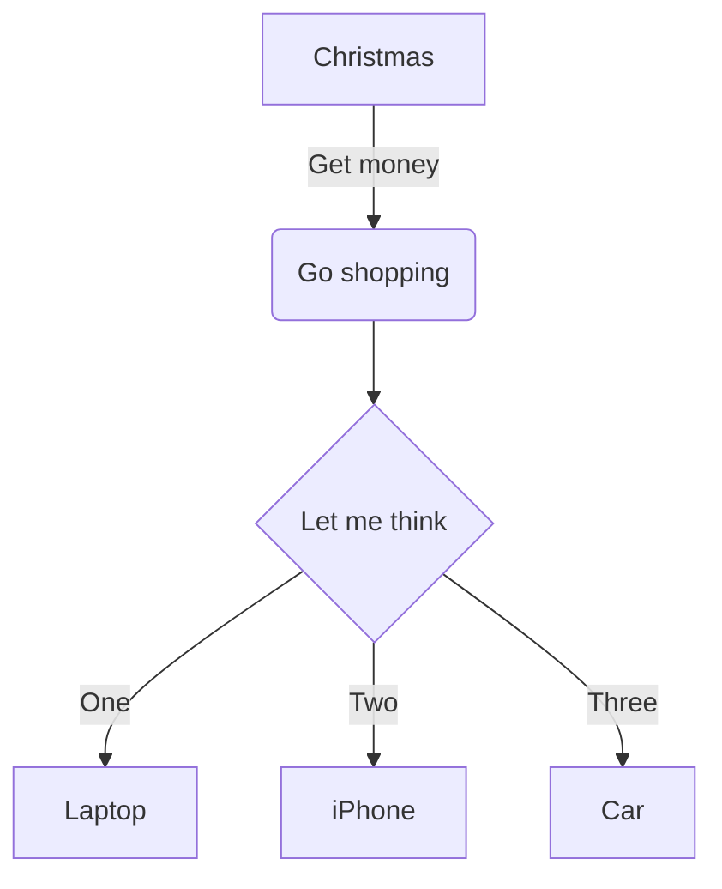

# Mermaid


```mermaid
graph TD
    A[Christmas] -->|Get money| B(Go shopping)
    B --> C{Let me think}
    C -->|One| D[Laptop]
    C -->|Two| E[iPhone]
    C -->|Three| F[Car]
```

# Header

## 1. Header

## (1) Header

## 【1】 Header

## 2. 日本語見出し

## 「2」 日本語見出し

## 【2】 日本語見出し

```csharp
Public void Sub1(string arg)
    Console.WriteLine(arg);
End Sub
```